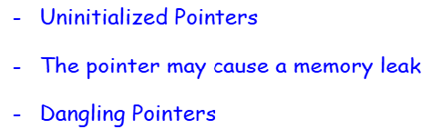
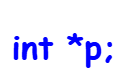
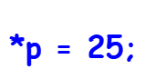
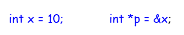
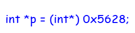
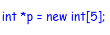
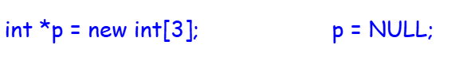
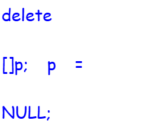

# Disadvantages of Pointers :-

## Uninitialized pointers in C++ :-

if we have declared a pointer then we should not use that pointer unless we have initialized it.

This means that we want to store the value ‘25’ wherever the pointer is pointing. But the question here is where the pointer is pointing? In, ‘int *p’ it is not pointing anywhere. Just we have declared. Then what is the address in ‘p’ here?

**Some default garbage addresses may be in ‘p’, some random addresses that may belong to a program or may not belong to a problem.**
 

So, it is an invalid address as we have not made a pointer to point to some particular location. So first of all, make it point to some location then we can access it.

There are 3 methods of doing it.

#### 1st Method :-

If we have some variable ‘x’ then, Now the pointer is pointing to this known variable ‘x’ which is already declared.

#### 2nd Method :-

We can assign some addresses using some hexadecimal codes but that address has to be type casted as an integer pointer. So, can we directly assign some addresses to a pointer? Yes, if we are sure that the address belongs to the program so this type of initialization is also allowed. **This is not commonly used. This is mostly used in systems programming**

#### 3rd Method :-

We can dynamically allocate some memory and assign that to a pointer. If we don’t write size and write only ‘int’ then it will allocate just one integer so either to an existing variable.

#### Memory Leak :-

This is related to a pointer as well as heap memory. As we have already discussed heap memory, when we are allocating heap memory then when we don’t require that, we should deallocate it. If we don’t deallocate it then we say that memory is leaked from that total set of memory.

**Here we have a pointer and I have allocated heap memory of some size. Then after some time, we don’t need this memory. So, we simply say ‘p = NULL’, then point P will not be pointing to that memory.We should not do this unless we have explicitly deleted the memory.**

So first of all, say delete ‘p’ then only, make ‘p’ as null.

**Now here is one more thing that we can write ‘p = 0’ also or write ‘p = nullptr‘.**

In modern C++ it is suggested to use ‘nullptr’. You should avoid using null. So back to this memory leak, the conclusion is you must delete the memory when you are not using it before making a pointer to null. Now let us move to the third problem which is the dangling pointer.
